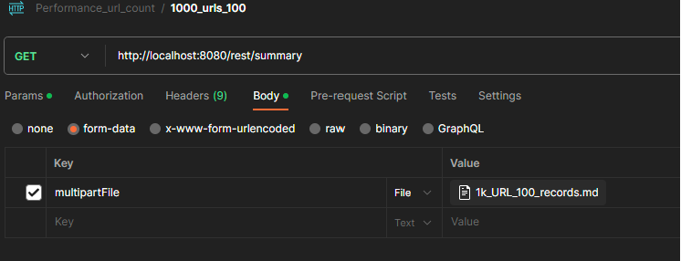
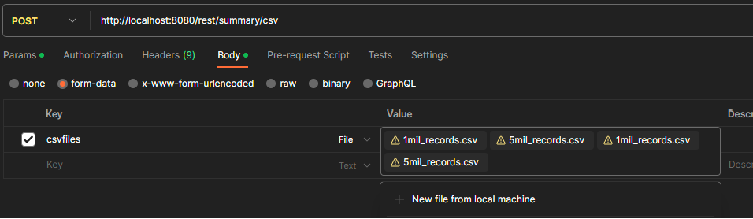
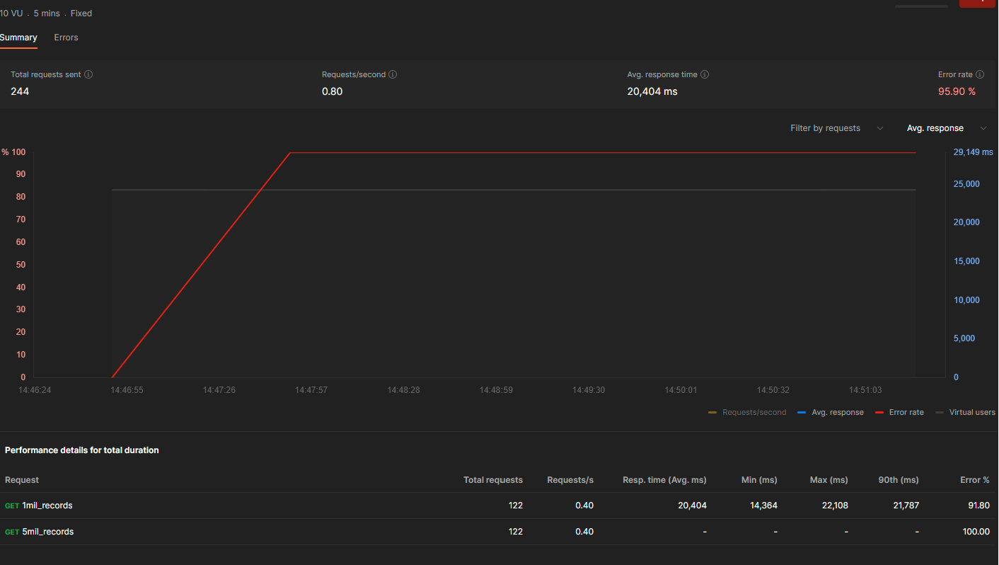
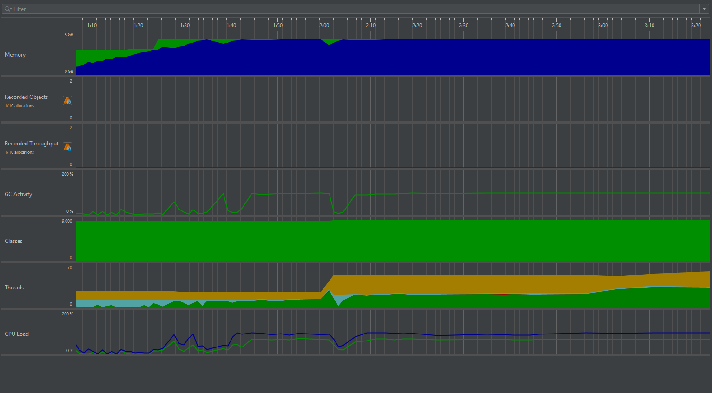
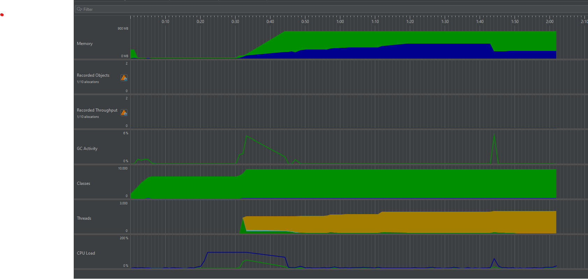

## Table of Contents

1. [Getting Started](#getting-started)
2. [Build and Run](#build-and-run)
    - [Maven Wrapper](#maven-wrapper)
    - [Docker](#docker)
3. [Testing Locally](#testing-locally)
4. [Questions](#questions)
    - [1. Design Decisions](#1-design-decisions)
    - [2. Assumptions in Design](#2-assumptions-in-design)
    - [3. Scaling for Large Files](#3-scaling-for-large-files)
    - [4. Processing Data from More Than 20K URLs](#4-processing-data-from-more-than-20k-urls)
    - [5. Testing for Production Use at Scale](#5-testing-for-production-use-at-scale)
    - [6. Even Number of Records](#6-even-number-of-records)
5. [Performance Testing](#performance-testing)
    - [1. CSV Files Accessed via URL](#1-csv-files-accessed-via-url)
        - [Record Count Metrics](#record-count-metrics)
        - [URL Count Metrics](#url-count-metrics)
    - [2. CSV Files Uploaded over HTTP](#2-csv-files-uploaded-over-http)
        - [Record Count Metrics](#record-count-metrics-1)
        - [URL Count Metrics](#url-count-metrics-1)
6. [Test Methodology](#test-methodology)
7. [Performance Metrics](#performance-metrics)
8. [Testing Results](#testing-results)
    - [Small Datasets](#small-datasets)
        - [Record Count Metrics](#record-count-metrics-2)
        - [URL Count Metrics](#url-count-metrics-2)

## Getting Started
### Description
Summary Statistics processes **flat CSV files** or **URL lists** over HTTP. It sends back 
statistics regarding the record data contained in the URLs or from flat CSV files.
### CSV format
| fname | lname   | age |
|-------|---------|-----|
| Homer | Simpson | 39  |
| Marge | Simpson | 39  |
| Lisa  | Simpson | 8   |


### Prerequisites
- java 8 or higher

## Build and Run
### Maven Wrapper
**Build**
   ```sh
   .\mvnw clean install
   ```
**Run app**
   ```sh
   java -jar .\target\summary-statistics-1.0-SNAPSHOT.jar
```
### Docker
**Build**
   ```sh
   docker build -t summary-statistics . 
   ```

**Docker run**
   ```sh
  docker run -p 8080:8080 summary-statistics:latest
   ```

## Testing locally
### cURL
You can send CSV flat file
   ```sh
   curl --location --request GET 'http://localhost:8080/rest/summary' --form 'multipartFile=@"{{PATH_TO_FLAT_FILE}}"'
   ```

### Postman
   ```sh
    GET - Multipart - "multipartFile={{PATH_TO_FLAT_FILE}}"
    http://localhost:8080/rest/summary 
    
    POST - List of Multipart - "csvfiles"
    http://localhost:8080/rest/summary/csv
   ```
### Examples


### Response
   ```sh
{
    "medianAge": 31.0,
    "averageAge": 33.8,
    "personWithMedianAge": "Rebecca STAFFORD",
    "timeInMillis": 335,
    "threadsUsed": 7,
    "urlErrors": [
        {
            "url": "https://raw.githubusercontent.com/marius-munteanu/reviews-scraper-service/main/testfiles-delete-later/file6_bad.csv",
            "errorName": "File is not a valid CSV"
        }
    ],
    "lineErrors": [
        {
            "url": "https://raw.githubusercontent.com/marius-munteanu/summary-statistics/file9_bad.csv",
            "lineWithError": [
                "RecordError on line: Melanie, POWELL, Faith, CHAVEZ, 49 for url https://raw.githubusercontent.com/marius-munteanu/reviews-scraper-service/main/testfiles-delete-later/file9_bad.csv",
                ...
        }
    ]
}
```

## Questions

### 1. Design Decisions

- **Microservices Approach:**
  I decided to build the service as a microservice instead of a standalone program. Microservices are easier to build and maintain. Additionally, it provides API access to resources and a unified response model for all calls contribute to a scalable architecture.

### 2. Assumptions in Design

- **Age Constraints:**
  No person of age above 150 or below 0. All ages are integer values, and there are no decimal points in person ages (e.g., 49.5).

- **Median Value Handling:**
  In case of even median values, the program returns a person name that is closest to the median age by rounding up and incrementing.

- **HTTP Requests:**
  All requests should be made via HTTP. Command-line programs are useful but for single use cases only.

- **Stable Connection:**
  The connection is stable.

- **URL Storage:**
  URLs containing the record data are assumed to be stored somewhere on the cloud, with no authentication needed to access the files.
Or uploaded directly from flat CSV files.

### 3. Scaling for Large Files

- **Handling Large Files:**
  If the program needs to process files with over 10 million records, potential approaches include scaling vertically, adjusting the number of threads, and implementing better parallel processing and streaming data.
- **Batch processing** and data structure optimization for efficient handling of large datasets.

### 4. Processing Data from More Than 20K URLs

  - If the program has to process data from more than 20K URLs, distributing the workload across multiple instances for horizontal scaling.

- **Caching Mechanism:**
   Introduce a caching mechanism to store previously retrieved data from URLs, reducing the need to fetch the same data repeatedly.

### 5. Testing for Production Use at Scale

- **Testing Strategies:**
  For production use at scale, testing strategies should include smoke tests, performance tests, logging, and setting up monitoring and alerts on a production like environment.

### 6. Even number of records

The identification of the person follows a two-step process. Initially, the algorithm checks if the two middle median values are identical; if they are, it randomly selects one of the persons. If the median values are not the same, it proceeds to round up the median value and checks if the corresponding person exists. If not, the median age is incremented by 1, and the process is repeated until a match is found.

## Performance Testing

I have created a series of performance tests utilizing mock data to evaluate the HTTP requests and response time of our service. These tests are designed to systematically evaluate the system's performance under increasing data loads. The tests will run using Postman and using 10 virtual users, memory usage will be continuously monitored using JProfiler.
### 1. CSV files that are stored on the cloud and accessed via URL

### Record Count Metrics:

1. **Small Dataset (Baseline):**
    - 1 URL with 1,000 records
    - 1 URL with 10,000 records

2. **Moderate Dataset:**
    - 1 URL with 10,000 records
    - 1 URL with 100,000 records

3. **Large Dataset:**
    - 1 URL with 100,000 records
    - 1 URL with 1,000,000 records

4. **XLarge Dataset:**
    - 1 URL with 1,000,000 records
    - 1 URL with 5,000,000 records

### URL Count Metrics:

1. **Small Dataset:**
    - 100 URLs with 100 records each

2. **Moderate Dataset:**
    - 1,000 URLs with 100 records each

3. **Large Dataset:**
    - 10,000 URLs with 100 records each

4. **XLarge Dataset:**
    - 20,000 URLs with 100 records each

### 2. CSV files that are uploaded over HTTP
### Record Count Metrics:
1. **XLarge Dataset:**
    - 1 CSV with 1,000,000 records
    - 1 CSV with 5,000,000 records
### URL Count Metrics:
1. **XLarge Dataset:**
    - 20,000 URLs with 100 records each

## Test Methodology:

- Each test will be executed by 10 virtual users in Postman.
- I will systematically increase the dataset sizes to analyze system performance under varying workloads.

## Performance Metrics:

**HTTP Requests:** Response time, throughput, and error rates.

**Memory Usage:** Memory consumption, garbage collection times

## Testing Results

### Small Datasets

For the small datasets, the performance was acceptable, using about 1 GB of memory and having successful throughput.

### Record Count Metrics:

We find that for a URL file that contains over 5 million records, our service runs out of memory and throws an OutOfMemoryException.

- Postman:
  
- JProfiler:
  

Available memory is quickly claimed by the service as it tries to keep pace with the new record files found. GC cannot free up memory as it does not have anything to clean up.

### URL Count Metrics:

For files/CSVs that contain 10k URLs and each one containing 100 Records, we find out that there is not sufficient processing power to manage all the requests.

- JProfiler:
  

All performance test results can be found in the [Images](Images) directory.
